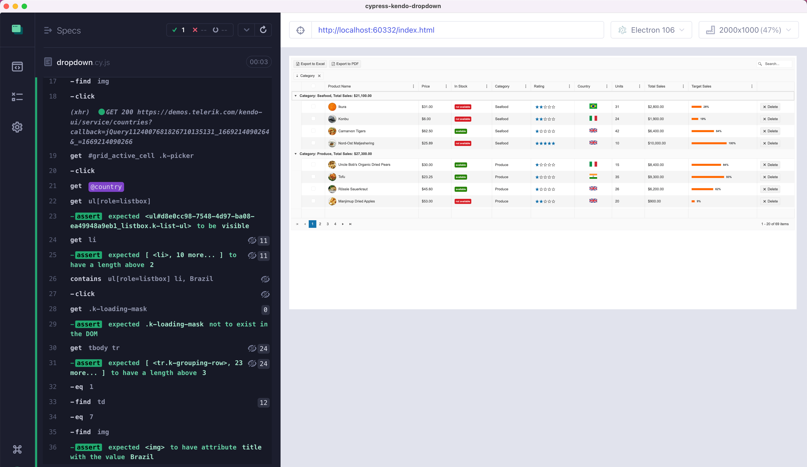

# cypress-kendo-dropdown

> Example testing Kendo country dropdown

- 📺 Watch the video [Testing Kendo UI Table And Country Select Dropdown](https://youtu.be/3c1nU-ULxnA)
- read the guide [Cypress retry-ability](https://on.cypress.io/retry-ability)

Tip: to learn how you could spy or stub JSONP api calls, check out my [Cypress Network Testing Exercises Course](https://cypress.tips/courses/network-testing)

## Small print

Author: Gleb Bahmutov &lt;gleb.bahmutov@gmail.com&gt; &copy; 2022

- [@bahmutov](https://twitter.com/bahmutov)
- [glebbahmutov.com](https://glebbahmutov.com)
- [blog](https://glebbahmutov.com/blog)
- [videos](https://www.youtube.com/glebbahmutov)
- [presentations](https://slides.com/bahmutov)
- [cypress.tips](https://cypress.tips)
- [Cypress Tips & Tricks Newsletter](https://cypresstips.substack.com/)
- [my Cypress courses](https://cypress.tips/courses)

License: MIT - do anything with the code, but don't blame me if it does not work.
